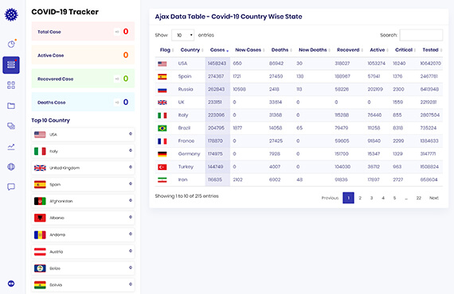
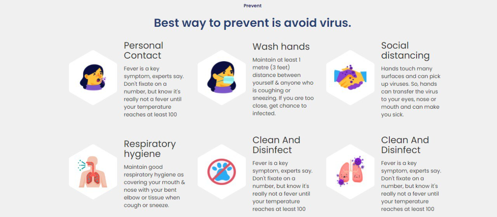
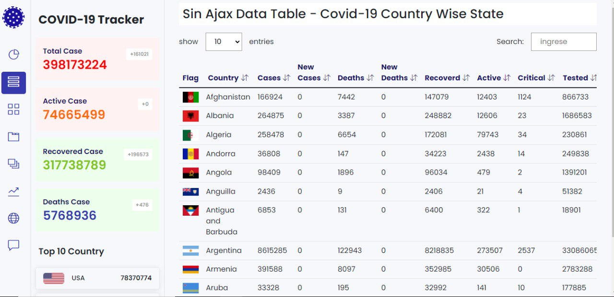

# Covid_19

Trabajaremos en crear una web que nos muestre los datos del Covid-19 a nuvel mundial. Con el prosposito de que las personas puedan estar bien informadas sobre la propagación de este virus.El Covid-19 es una realidad que afrontamos en este siglo, y a pesar de ser tan malo, gracias a la tecnología podemos luchar contra él creando estrategias, medidas de contención basándonos en datos que podemos recoger y mantener informado a cualquier usuario de la situación en cada país.

<h1>Utimas-adiciones</h1>

Cambios en la ultima versión:

*Se añadieron animaciones en la seccion PREVENT del archivo index 

 
 

Correciones:
 

*Se hicieron correciones de ortografía

 <h1>Costo-del-proyecto</h1>
 
El costo del proyecto en ningún momento alcanzo el nivel monetario, unicamente se le invirtio tiempo y dedicación.

<h1>Requerimientos-del-proyecto</h1>

Para que nuestro proyecto funcionara se requeria el cumplimiento de los siguientes requisitos:

*El proyecto DEBE utilizar la metodología Scrum.
 

*Se DEBE utilizar Gitflow.
 

*Se DEBE consumir la API de disease.sh para traer los datos.
 

*La página DEBE ser responsive.
 

*Se debe hacer una landing page que sea fiel a mockup.
 

*El diseño DEBE ser fiel al mockup y utilizar las imágenes y los íconos que se dejaron en los recursos.
 

*La página DEBE mostrar los datos que aparcen en los mockups:
-Total de contagios. 
-Total muertes. 
-Total de recuperados. 
-Total de casos activos. 
-Nuevos casos. 
-Nuevas muertes. 
 

*La página DEBE filtrar por países.
 

*En la parte de la tabla se DEBE poder organizar en orden según cada item.
 

*La página DEBE Permitir que el usuario decida qué numero de resultados quiere ver en la tabla.
 

*La página debe permitir búsquedas por palabras clave.
 

*La página DEBE mostrar en alguna parte la cantidad de vacunados en el mundo.
 

*La página DEBE filtrar los vacunados por país.
 

*El sitio debe ser interactivo y generar las animaciones que se muestran en el video
 

*No se pueden utilizar frameworks ni librerías de Javascript excepto la especificada en las recomendaciones.
 

*El repositorio DEBE tener un Readme muy específico, con capturas de pantalla y los pasos para la instalación de las librerías si las van a usar.

 
<h1>Requerimientos-de-software</h1>

Nos fue necesario utilizar metodos externos para poder visualizar archivos JSON
 

<h1>Construcción-y-uso</h1>

Para la construcción de nuestro sitio web se utilizo HTML, CSS, JAVASCRIPT, Bootstrap y una API. El uso es posible mediante clicks del mouse.

<h1>Excepción-de-Responsabilidades</h1>

El presente proyecto se comparte "tal cual" con el único objetivo de que sea útil. El/los creadores del presente hardware y su software asociado no pueden garantizar su correcto funcionamiento bajo ninguna circunstancia. El/Los autor/es de este proyecto no podrá/n hacerse responsable/s de cualquier pérdida de carácter material, personal o económico a su persona o terceros derivados de la utilización del mismo. Este proyecto no deberá ser utilizado bajo ninguna circustancia en sistemas de carácter crítico o sistemas de los cuales dependan vidas de personas de manera directa o indirecta.

<h1>Licenciamiento</h1>

La plantilla de este README.md ha sido desarrollada por la comunidad openhardware.sv con el objetivo de facilitar la documentación de proyectos. Esta plantilla está protegida bajo la licencia CC BY, puedes modificarla y redistribuirla manteniendo esta nota de atribución del autor.

